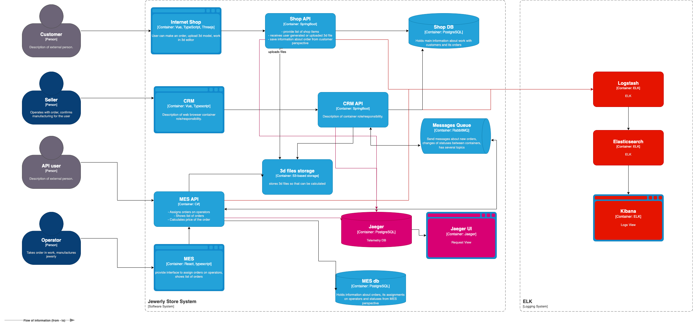

# T4. Архитектурное решение по логированию

## Требуемые логи для сбора

1. **На ПРОМ среде**: все логи уровня `WARN`, `ERROR`, `FATAL`, `INFO`. Уровень `DEBUG` исключаем.  
2. **На DEV среде**: логи всех уровней.  
3. **На RELEASE среде**: все логи уровня `WARN`, `ERROR`, `FATAL`, `INFO`. Уровень `DEBUG` исключаем.

> **Почему исключаем `DEBUG` на ПРОМ и RELEASE:** логи уровня `DEBUG` могут занимать значительный объём в хранилище (Elastic), что сокращает время доступного хранения. При необходимости детальной отладки этот уровень можно включить вручную. Важно отслеживать основные ошибки и текущее состояние работы системы.

## Обязательные поля в логах

1. **Источник** – сервис, кластер и т.п.  
2. **Дата записи**  
3. **Сообщение**  
4. **StackTrace** (в случае ошибок)

## Критичные логи уровня INFO

1. **Создание / Редактирование / Отмена заказа**  
   - Должно содержать номер заказа, ID пользователя, данные запроса (статус заказа, поля заказа).  
2. **Логи обработки заказа**  
   - Информация о действиях с заказом.  
3. **Логи формирования корзины**  
   - Информация о деталях товара.  
4. **Вход в систему**  
5. **Запросы на получение списка заказов**  
   - Информация о фильтрах в запросе и количество найденных товаров.

> **Важно**: Все запросы должны иметь **входящий лог** (при получении запроса) и **исходящий лог** (при отправке ответа).

## Мотивация

1. **Отслеживание ошибок:** логи позволяют быстро выявить ошибки и локализовать проблемное место.  
2. **Диагностика задержек:** логи помогут понять, почему определённые запросы обрабатываются долго или вызывают сбои.  
3. **Аналитика пользовательских действий:** даёт представление о том, какие фичи наиболее востребованы.  
4. **Приоритеты развития:** на основе логов можно определить, какие системы критичнее всего развивать и усиливать с точки зрения надёжности.

## Предлагаемое решение

1. **Использовать ELK-стек** (Elasticsearch, Logstash, Kibana) как наиболее распространённое и проверенное решение для сбора и анализа логов.  
2. **Исключить конфиденциальную информацию** из логов:  
   - Не логировать пароли и ключи конфигураций.  
   - Не указывать персональные данные пользователей в открытом виде (ФИО, телефоны и т.п.).  
3. **Ограничить доступ к логам**:  
   - Логи доступны только во внутреннем сегменте сети.  
   - Доступ имеют только инженеры сопровождения/разработчики по сертификату.  
4. **Сроки и объём хранения**:  
   - Хранить логи минимум **2 недели**.  
   - Общий объём логов на кластер ELK — до **100 ГБ**.  
5. **Отдельные индексы для каждого сервиса**, чтобы удобно фильтровать и анализировать информацию.

## Мониторинг логов

1. **График с общим количеством ошибок** для отслеживания динамики и быстрого выявления аномалий.  
2. **Алерт при резком повышении количества ошибок** (например, нескольких `ERROR` подряд) с уведомлением ответственных лиц.  
3. **Алерт при резком росте заказов** для предупреждения потенциальной DDoS-атаки или перегрузки системы.  
4. **Алерт при резком падении заказов** для уведомления о возможной недоступности сервисов или проблемах с сетью.

